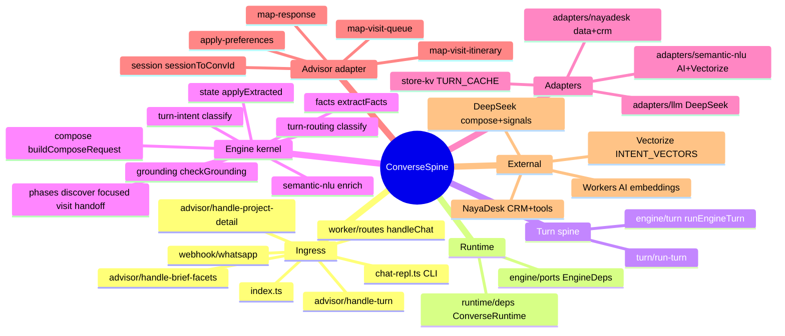
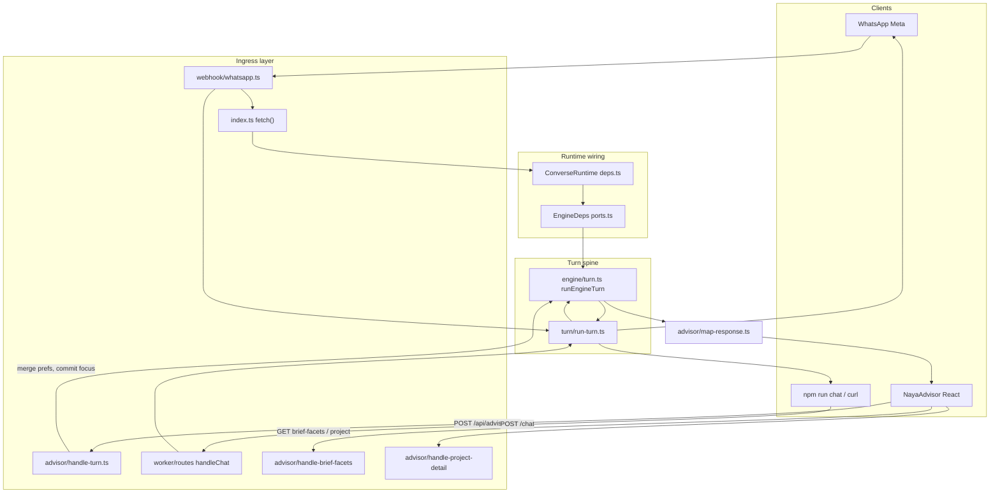
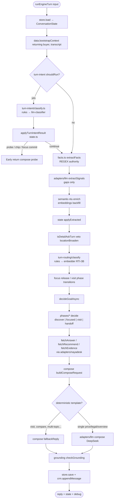
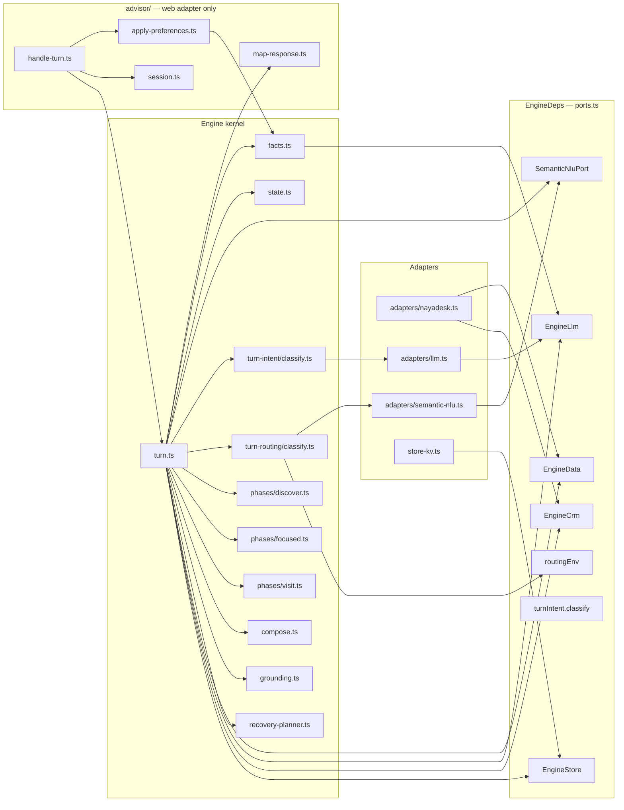
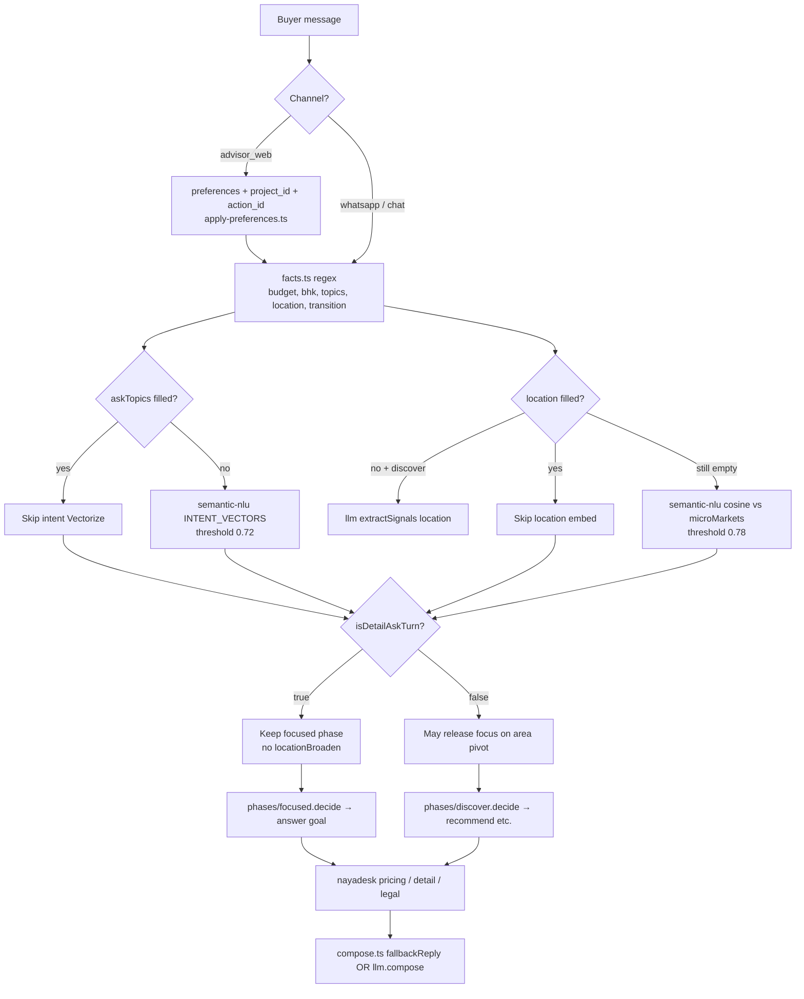

# ConverseSpine architecture map

Visual reference for layers, classes, and turn flow. Complements [`CONVERSE_ENGINE.md`](./CONVERSE_ENGINE.md) (design invariants) and [`PRODUCTION_STACK.md`](./PRODUCTION_STACK.md) (deploy/bindings).

**Last updated:** 2026-07-08

---

## Authority model (regex vs embeddings vs LLM)

| Layer | Advisor web (`/api/advisor/turn`) | Free text (`/chat`, WhatsApp) |
|-------|-----------------------------------|-------------------------------|
| **Structured UI** | `preferences`, `project_id`, `action_id` — authority | N/A |
| **Regex / rules** | Wins when slots are filled | First pass — budget, BHK, topics, location, transition |
| **Embeddings** | Skip if `askTopics` / location already set | Gap-fill: intent Vectorize (≥0.72), location cosine (≥0.78) |
| **LLM signals** | Rare | `extractSignals` only for unfilled location/type/purpose/transition |
| **LLM compose** | Polish reply from evidence | Same — `fallbackReply` when deterministic or no API key |

**Conflict rule:** regex wins when confident. Embeddings/LLM fill gaps or break ties — they do not override gated regex hits (e.g. `isDetailAskTurn` blocking focus release).

---

## 1. Repo layers (bird's-eye)



---

## 2. Channel ingress → same kernel

All channels converge on `runEngineTurn` in `src/engine/turn.ts`.



### HTTP routes (`src/index.ts`)

| Route | Handler | Channel |
|-------|---------|---------|
| `POST /chat` | `worker/routes.handleChat` → `runTurn` | Dev REPL, curl, playground |
| `POST /api/advisor/turn` | `advisor/handle-turn` | NayaAdvisor web |
| `GET /api/advisor/brief-facets` | `advisor/handle-brief-facets` | Onboarding chips |
| `GET /api/advisor/project` | `advisor/handle-project-detail` | Project detail panel |
| `POST /webhook` | `webhook/whatsapp` → `runTurn` | WhatsApp |
| `GET /health` | `worker/routes.health` | Ops |

---

## 3. One turn inside `runEngineTurn` (layer stack)



---

## 4. Class / module interaction



### `advisor/` folder (not the React app)

| File | Role |
|------|------|
| `handle-turn.ts` | Web ingress: prefs, sticky focus, then `runEngineTurn` |
| `apply-preferences.ts` | Brief chips → `constraints` |
| `session.ts` | `session_id` → `advisor:{id}` KV key + synthetic phone |
| `map-response.ts` | Engine output → `AdvisorTurnResponse` (cards, visit queue, ui_mode) |
| `map-visit-queue.ts` / `map-visit-itinerary.ts` | Visit board DTOs |
| `handle-brief-facets.ts` / `brief-facets.ts` | Catalog-backed onboarding options |
| `handle-project-detail.ts` / `map-project-detail.ts` | Focused project panel |

NayaAdvisor UI components live in the **NayaAdvisor** repo. This folder is the API contract.

---

## 5. Extraction authority decision tree



### `isDetailAskTurn` (focus guard)

Used once in `turn.ts` to veto `locationBroaden` on focused phase:

- Any non-compare `askTopic` / `askTopics` → detail ask
- Or `transition === 'want_details'`
- Or `implicitProjectPick`

Does **not** compose the reply — only prevents erroneous focus release.

---

## 6. Phase goal tables

| Phase | Module | Typical goals |
|-------|--------|---------------|
| `discover` | `phases/discover.ts` | `greet`, `orient`, `probe`, `recommend`, `no_fit`, `commit` |
| `focused` | `phases/focused.ts` | `answer` (price, legal, location, …), `objection`, `propose_visit` |
| `visit` | `phases/visit.ts` | `visit_ask`, `visit_propose`, `visit_booked`, route expand |
| `handoff` | `phases/handoff.ts` | Post-visit wrap, `warm_ack` |

`decideGoalAsync` in `turn.ts` may intercept focused project switch before phase `decide`.

---

## 7. Compose path

```text
buildComposeRequest(goal, evidence, context)
  → deterministic? → fallbackReply(req)     [visit, compare, multi-topic, shortlist, …]
  → else             → llm.compose(req)       [DeepSeek — single-topic price/legal/overview]
  → stripBanned + checkGrounding
  → if ungrounded    → fallbackReply (repair)
```

Evidence is fetched **before** compose (`fetchAnswer`, `fetchRecommend`, …) via `adapters/nayadesk.ts` — pricing, landed cost, compare matrix, media, units, objection playbooks.

---

## 8. Debug breakpoint cheat sheet

| Order | File | Symbol | What to watch |
|-------|------|--------|---------------|
| 1 | `engine/turn.ts:86` | `runEngineTurn` | Single brain entry (all channels) |
| 2 | `engine/turn.ts:198` | RTI classify | Recovery chip / probe fast path |
| 3 | `engine/facts.ts` | `extractFacts` | Regex + LLM signal output |
| 4 | `engine/adapters/semantic-nlu.ts:49` | `enrich` | Embeddings (intent + location) |
| 5 | `engine/turn.ts:310` | `isDetailAskTurn` | Focus guard vs locationBroaden |
| 6 | `engine/phases/focused.ts:11` | `decide` | Goal = answer / visit / objection |
| 7 | `engine/turn.ts:1039` | `fetchAnswer` | NayaDesk tool evidence |
| 8 | `engine/turn.ts:483` | `buildComposeRequest` | Compose input bundle |
| 9 | `engine/turn.ts:524` | `deps.llm.compose` | Final reply draft |

**Local dev:** Terminal 1 `npm run dev` (port 8789) · Terminal 2 `npm run chat` · F5 `CS: Wrangler dev + attach`.

---

## 9. Key file index

```text
src/
  index.ts                      HTTP router
  runtime/deps.ts               ConverseRuntime wires EngineDeps
  turn/run-turn.ts              /chat + WhatsApp wrapper
  worker/routes.ts              handleChat, health
  webhook/whatsapp.ts           Meta ingress
  advisor/                      NayaAdvisor web adapter (see §4)
  engine/
    turn.ts                     Main loop
    facts.ts                    Regex + LLM signals
    state.ts                    ConversationState, applyExtracted, commitTo
    compose.ts                  Prompt + fallbackReply
    grounding.ts                Verifier
    phases/                     Phase goal tables
    turn-intent/                RTI recovery, chip taps, focused pivot
    turn-routing/               RTI-3B visit vs answer (telemetry gate)
    adapters/
      nayadesk.ts               EngineData + EngineCrm
      llm.ts                    DeepSeek compose + extractSignals
      semantic-nlu.ts           Workers AI + Vectorize enrich
    store-kv.ts                 TURN_CACHE persistence
  crm/nayadesk-client.ts        NayaDesk service binding client
  chat-repl.ts                  Interactive terminal client
```

---

## Related docs

- [`CONVERSE_ENGINE.md`](./CONVERSE_ENGINE.md) — design loop and invariants
- [`CONVERSESPINE_LAYER_GUIDE.md`](./CONVERSESPINE_LAYER_GUIDE.md) — per-layer when/why/examples
- [`PRODUCTION_STACK.md`](./PRODUCTION_STACK.md) — wrangler bindings, dev/prod
- [`CONTRIBUTING.md`](./CONTRIBUTING.md) — test and PR discipline
